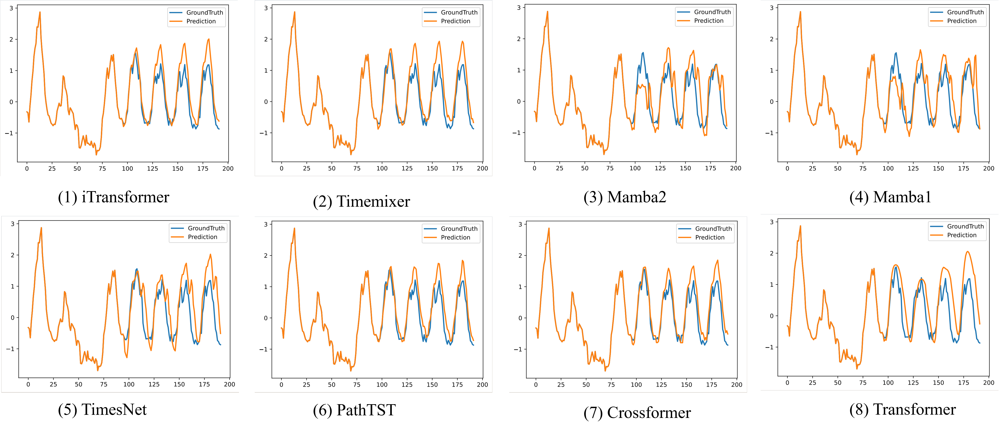

# MambaLTS

The repo is the implementation for analysing Long Time Series Tasks using Mamba1 \& Mamba2 architecture:
## &#x1F389; News
* **[2024.08.15]**  We find a good set of hyperparameters for Mamba1, Mamba2 
## Installation and Requirements
Please note that our project depends on mamba-ssm. You need to carefully check the corresponding versions of torch, cuda, mamba-ssm and python to prevent wheel installation from failing.

We use *python-3.11* \& *torch-2.0.0* \& *cuda-11.8*  
1. Clone this repository and navigate to the folder
```bash
git clone https://github.com/Peilin-FF/MambaLTS.git
cd MambaLTS
```

2. Create a conda environment, activate it and install Packages
```Shell
conda create -n MambaLTS python=3.10 -y
conda activate MambaLTS
pip install --upgrade pip 
pip install -r requirements.txt
```

3. Install Environment
```Shell
pip install torch==2.0.0+cu118
```
```Shell
wget https://github.com/state-spaces/mamba/releases/download/v2.2.2/mamba_ssm-2.2.2+cu118torch2.0cxx11abiFALSE-cp311-cp311-linux_x86_64.whl
```
```Shell
wget https://github.com/Dao-AILab/causal-conv1d/releases/download/v1.4.0/causal_conv1d-1.4.0+cu118torch2.0cxx11abiFALSE-cp311-cp311-linux_x86_64.whl
```
After all the work, you need to pip install triton==2.3.0 again, because there is a false version triton==2.0.0 bug in mamba-ssm package.
```Shell
pip install triton==2.3.0
pip install sktime==0.16.1
```
Different machines have different situations, pip install according to the traceback prompts is a necessary method.

4.Prepare Data. 
You can obtain the well pre-processed datasets from [[Google Drive]](https://drive.google.com/drive/folders/13Cg1KYOlzM5C7K8gK8NfC-F3EYxkM3D2?usp=sharing) or [[Baidu Drive]](https://pan.baidu.com/s/1r3KhGd0Q9PJIUZdfEYoymg?pwd=i9iy), Then place the downloaded data in the folder`./dataset`.

Here we give you a table to introduce the dataset:
| **Dataset**     | **Size (MB)** | **Frequency** | **Unit** | **Dimension** | **Length** | **Train** | **Val** | **Test** |
|-----------------|---------------|---------------|----------|---------------|------------|-----------|---------|----------|
| Electricity     | 95.6          | 1             | hour     | 321           | 26304      | 18413     | 2673    | 5261     |
| Traffic         | 136.5         | 1             | hour     | 862           | 17544      | 12281     | 1757    | 3509     |
| Weather         | 7.2           | 10            | minute   | 21            | 52696      | 36888     | 5275    | 10540    |
| Exchange\_rate  | 0.6           | 1             | day      | 8             | 7588       | 5312      | 761     | 1518     |
| ETTh1           | 10.4          | 1             | hour     | 7             | 17420      | 8641      | 2881    | 2881     |
| ETTh2           | 10.4          | 1             | hour     | 7             | 17420      | 8641      | 2881    | 2881     |
| ETTm1           | 2.6           | 15            | minute   | 7             | 69680      | 35561     | 11521   | 11521    |
| ETTm2           | 2.6           | 15            | minute   | 7             | 69680      | 35561     | 11521   | 11521    |

5.Install wandb

Weights and Biases (wandb) is a powerful tool for tracking machine learning experiments, visualizing model performance, and collaborating with team members in real time. For more tutorial, click [[video]](https://www.youtube.com/watch?v=hmewPDNUNJs&list=PLD80i8An1OEGajeVo15ohAQYF1Ttle0lk)
```Shell
pip install wandb
```
Open the web in your terminal and copy the keys into the terminal.

Open exp/exp_long_term_forecasting.py
```python
# Input your own project name and entity here!
wandb.init(project="your own project name", name=self.args.runname, entity="your entity")
```
## Train and evaluate model
We provide the experiment scripts models under the folder `./scripts/`. You can reproduce the experiment results as the following examples:
bash ./scripts/long_term_forecast/ECL_script/Mamba.sh

7.Implement Details

### Experiment Details

We used an NVIDIA RTX 3090 GPU and the PyTorch framework. The hyperparameters for the experiments followed the settings provided in [this repository](https://github.com/thuml/Time-Series-Library.git). The detailed settings are as follows:

- **Initial learning rate**: $10^{-3}$
- **Learning rate update method**: Linear decay
- **Optimizer**: ADAM
- **Loss function**: L2 loss
- **Batch size**: 32
- **Maximum epochs**: 10
- **Early stopping mechanism**: Enabled

**Good Set of Hyperparameters**:

- **Embedding and Mamba's $d_{model}$**: Set to 128
- **Mamba's expand parameter**: Set to 1
- **$d_{state}$**: Set to 16
- **Number of layers ($n_{layer}$)**: Set between 1 or 2 

## Result Shots

All the results are averaged from 4 different predictionlengths, that is \{96, 192, 336, 720\}. A lower MSE or MAE indicates a better prediction. We fix theinput length as 96 for all experiments.
| Models         | TimeMixer (2024a) | iTransformer (2023) | PatchTST (2023) | TimesNet (2023) | Mamba2 (2023) | Mamba1 (?) | Crossformer (?) | MICN (?) | Autoformer (?) | Informer (?) |
|----------------|-------------------|---------------------|-----------------|-----------------|---------------|------------|-----------------|----------|----------------|--------------|
| **Metric**     | MSE    | MAE    | MSE    | MAE    | MSE    | MAE    | MSE    | MAE    | MSE    | MAE    | MSE    | MAE    | MSE    | MAE    | MSE    | MAE    | MSE    | MAE    | MSE    | MAE    |
| **Electricity**| 0.182  | 0.272  | 0.148  | 0.240  | 0.216  | 0.318 | 0.193 | 0.304 | 0.177 | 0.272 | 0.185 | 0.287 | 0.204 | 0.334 | 0.196 | 0.309 | 0.227 | 0.338 | 0.311 | 0.397 | 0.260 |
| **Weather**    | 0.240  | 0.271  | 0.174  | 0.214  | 0.265  | 0.285 | 0.251 | 0.294 | 0.191 | 0.241 | 0.194 | 0.242 | 0.264 | 0.320 | 0.268 | 0.321 | 0.338 | 0.382 | 0.630 | 0.548 | 0.395 |
| **Traffic**    | 0.484  | 0.297  | 0.395  | 0.668  | 0.529  | 0.341 | 0.620 | 0.360 | 0.481 | 0.303 | 0.667 | 0.426 | 0.548 | 0.450 | 0.459 | 0.457 | 0.589 | 0.471 | 0.634 | 0.596 | 0.473 | x.xxx |
| **ETTh1**      | 0.147  | 0.440  | 0.368  | 0.405  | 0.156  | 0.484 | 0.495 | 0.450 | 0.161 | 0.381 | 0.493 | 0.482 | 0.614 | 0.438 | 0.594 | 0.470 | 0.479 | 0.644 | 0.519 | 0.481 | 0.795 | x.xxx |
| **ETTh2**      | 0.364  | 0.395  | 0.297  | 0.349  | 0.391  | 0.411 | 0.410 | 0.427 | 0.346 | 0.377 | 0.367 | 0.388 | 0.642 | 0.684 | 0.574 | 0.605 | 0.459 | 0.574 | 0.589 | 0.573 | 1.729 | x.xxx |
| **ETTm1**      | 0.381  | 0.395  | 0.334  | 0.368  | 0.406  | 0.407 | 0.400 | 0.344 | 0.377 | 0.395 | 0.413 | 0.454 | 0.429 | 0.588 | 0.517 | 0.422 | 0.588 | 0.571 | 0.691 | 0.734 | x.xxx |
| **ETTm2**      | 0.275  | 0.323  | 0.180  | 0.264  | 0.291  | 0.292 | 0.334 | 0.291 | 0.204 | 0.280 | x.xxx | x.xxx | 0.757 | 0.610 | 0.353 | 0.402 | 0.327 | 0.371 | 0.410 | 0.810 | x.xxx |

ECL Result:
<p align="center">

</p>

## Contact
If you have any questions, feel free to either initiate an *Issue* or contact us by Email (Email: *fengpeilin@buaa.edu.cn*).

## ❤️ Community efforts
* Our codebase and data source is built upon the [Time-Series-Library](https://github.com/thuml/Time-Series-Library) project. Great work!
